# AI/ML-Driven Automated Feature Detection and Change Analysis of Glacial Lakes

This project uses deep learning for automated detection of **glacial lakes** from multi-source satellite imagery (Sentinel-2 `.tif`, PNG). Built with a U-Net segmentation model, it enables climate change analysis, risk prediction, and future feature tracking.

## 📖 Project Overview

This project automates the detection of glacial lakes using satellite imagery through semantic segmentation. It helps monitor the formation and expansion of glacial lakes, which are critical indicators of climate change and potential GLOF (Glacial Lake Outburst Flood) risks.

Due to climate change and accelerated glacial melt, new glacial lakes are forming and existing ones are expanding across mountainous regions. These lakes pose potential dangers through Glacial Lake Outburst Floods (GLOFs). Manual monitoring is time-consuming and resource-intensive, making automated detection crucial for timely risk assessment.

## 👥 Use Case Diagram

### Primary Actors and Use Cases

```mermaid
graph TB
    subgraph "Glacial Lake Detection System"
        subgraph "Core System Functions"
            UC1[Upload Satellite Image]
            UC2[Process Image]
            UC3[Generate Lake Mask]
            UC4[Create Visualizations]
            UC5[Download Results]
            UC6[Analyze Lake Coverage]
            UC7[Extract Contours]
            UC8[View Historical Data]
            UC9[Export Reports]
            UC10[Validate Results]
        end
        
        subgraph "Administrative Functions"
            UC11[Monitor System Performance]
            UC12[Update Model]
            UC13[Manage User Access]
            UC14[Configure System Settings]
        end
        
        subgraph "Research Functions"
            UC15[Compare Time Series]
            UC16[Conduct Analysis]
            UC17[Publish Findings]
            UC18[Collaborate with Team]
        end
    end
    
    subgraph "External Actors"
        Actor1[Research Scientist]
        Actor2[Government Official]
        Actor3[Climate Researcher]
        Actor4[Disaster Management Officer]
        Actor5[System Administrator]
        Actor6[Data Analyst]
        Actor7[Policy Maker]
        Actor8[Academic Researcher]
    end
    
    subgraph "External Systems"
        Ext1[Satellite Data Provider]
        Ext2[Weather API]
        Ext3[GIS Systems]
        Ext4[Report Generation System]
    end
    
    %% Primary Actor Relationships
    Actor1 --> UC1
    Actor1 --> UC2
    Actor1 --> UC3
    Actor1 --> UC4
    Actor1 --> UC5
    Actor1 --> UC15
    Actor1 --> UC16
    Actor1 --> UC17
    
    Actor2 --> UC1
    Actor2 --> UC6
    Actor2 --> UC8
    Actor2 --> UC9
    Actor2 --> UC10
    
    Actor3 --> UC1
    Actor3 --> UC2
    Actor3 --> UC15
    Actor3 --> UC16
    Actor3 --> UC18
    
    Actor4 --> UC6
    Actor4 --> UC7
    Actor4 --> UC8
    Actor4 --> UC9
    Actor4 --> UC10
    
    Actor5 --> UC11
    Actor5 --> UC12
    Actor5 --> UC13
    Actor5 --> UC14
    
    Actor6 --> UC1
    Actor6 --> UC6
    Actor6 --> UC9
    Actor6 --> UC16
    
    Actor7 --> UC8
    Actor7 --> UC9
    Actor7 --> UC10
    
    Actor8 --> UC1
    Actor8 --> UC15
    Actor8 --> UC17
    Actor8 --> UC18
    
    %% External System Relationships
    UC1 --> Ext1
    UC8 --> Ext2
    UC9 --> Ext3
    UC9 --> Ext4
```

### Detailed Use Case Descriptions

#### **Primary Use Cases**

| Use Case | Actor | Description | Preconditions | Postconditions |
|----------|-------|-------------|---------------|----------------|
| **Upload Satellite Image** | Research Scientist, Government Official, Climate Researcher | User uploads satellite imagery files (.tif, .png, .jpg) for analysis | System is running, User has image file | Image is uploaded and validated |
| **Process Image** | Research Scientist, Climate Researcher | System preprocesses the uploaded image for ML model input | Image is uploaded | Image is ready for model inference |
| **Generate Lake Mask** | All Primary Actors | ML model generates binary mask identifying glacial lakes | Preprocessed image available | Binary mask is generated |
| **Create Visualizations** | All Primary Actors | System creates various visualizations (overlay, contours, analysis) | Lake mask is generated | Visualizations are displayed |
| **Download Results** | All Primary Actors | User downloads generated masks, overlays, or reports | Results are available | Files are downloaded to user's device |
| **Analyze Lake Coverage** | Government Official, Disaster Management Officer | Calculate and display lake coverage statistics | Lake mask is generated | Coverage metrics are displayed |
| **Extract Contours** | Disaster Management Officer, Data Analyst | Extract and visualize lake boundaries | Binary mask is available | Contours are extracted and displayed |
| **View Historical Data** | Government Official, Policy Maker | Access historical lake data and trends | Historical data exists | Historical analysis is displayed |
| **Export Reports** | Government Official, Policy Maker, Data Analyst | Generate and export detailed analysis reports | Analysis is complete | Report is generated and exported |

#### **Administrative Use Cases**

| Use Case | Actor | Description | Preconditions | Postconditions |
|----------|-------|-------------|---------------|----------------|
| **Monitor System Performance** | System Administrator | Monitor application performance and usage | Admin access granted | Performance metrics are visible |
| **Update Model** | System Administrator | Deploy new or updated ML models | New model is available | Model is updated in system |
| **Manage User Access** | System Administrator | Control user permissions and access levels | Admin privileges | User access is configured |
| **Configure System Settings** | System Administrator | Modify system configuration parameters | Admin access | Settings are updated |

#### **Research Use Cases**

| Use Case | Actor | Description | Preconditions | Postconditions |
|----------|-------|-------------|---------------|----------------|
| **Compare Time Series** | Research Scientist, Academic Researcher | Compare lake changes over multiple time periods | Multiple datasets available | Temporal analysis is complete |
| **Conduct Analysis** | Research Scientist, Climate Researcher, Data Analyst | Perform detailed scientific analysis of results | Results are available | Analysis is documented |
| **Publish Findings** | Research Scientist, Academic Researcher | Share research findings with scientific community | Analysis is complete | Findings are published |
| **Collaborate with Team** | Research Scientist, Academic Researcher | Share data and collaborate with research team | Team access is configured | Collaboration is facilitated |

### Actor Relationship Diagram

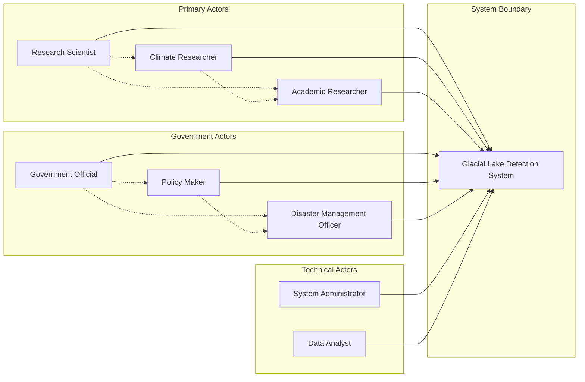

### System Context Use Case

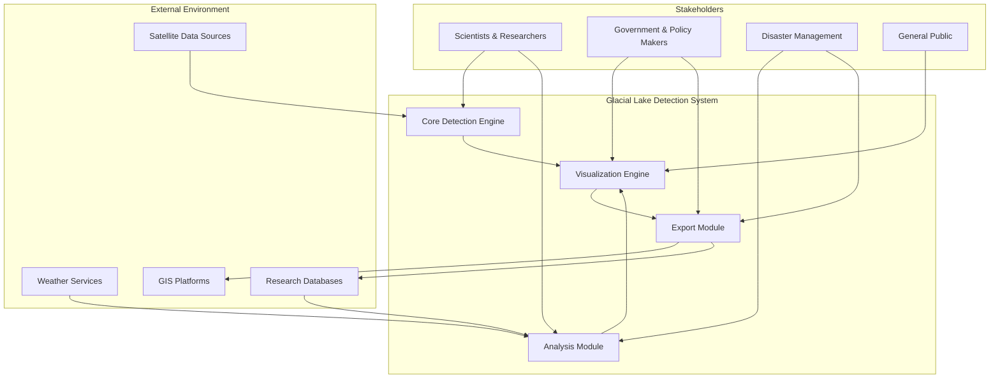

### Use Case Scenarios

#### **Scenario 1: Research Scientist Workflow**

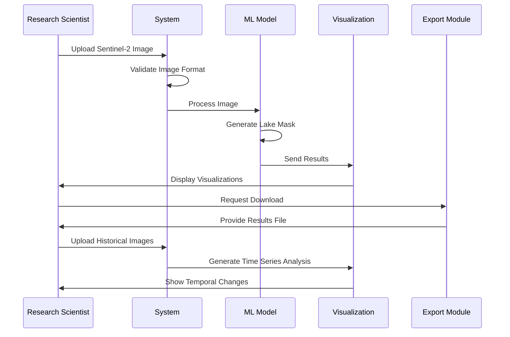

#### **Scenario 2: Government Official Monitoring**

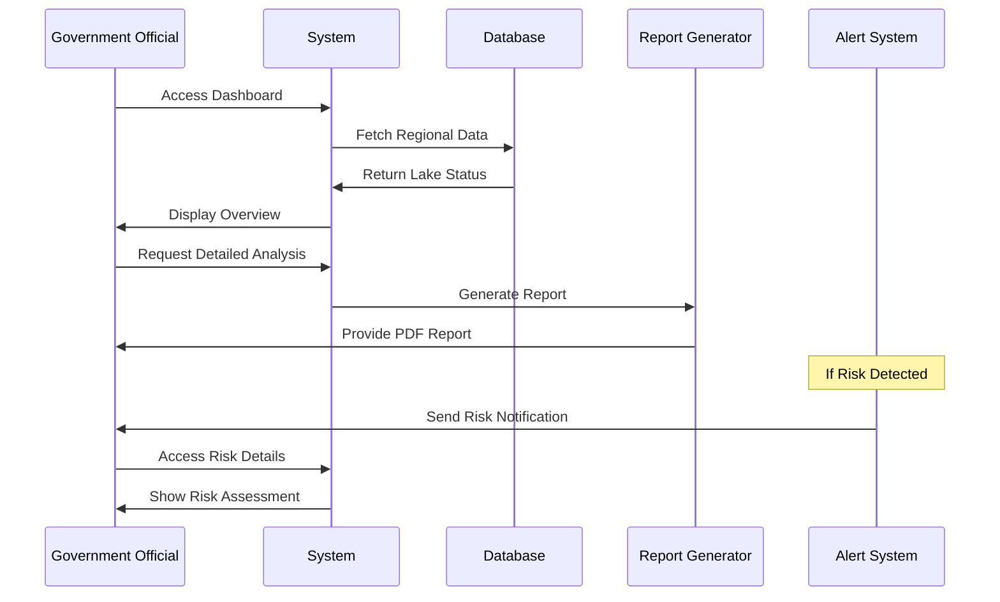

#### **Scenario 3: Disaster Management Response**

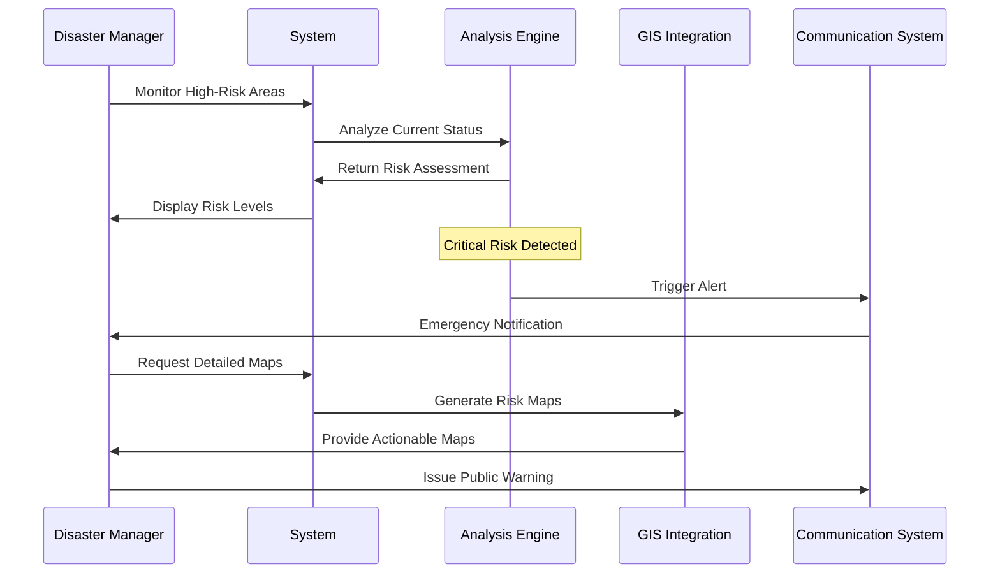

## 🏗️ System Architecture Overview

### High-Level System Architecture

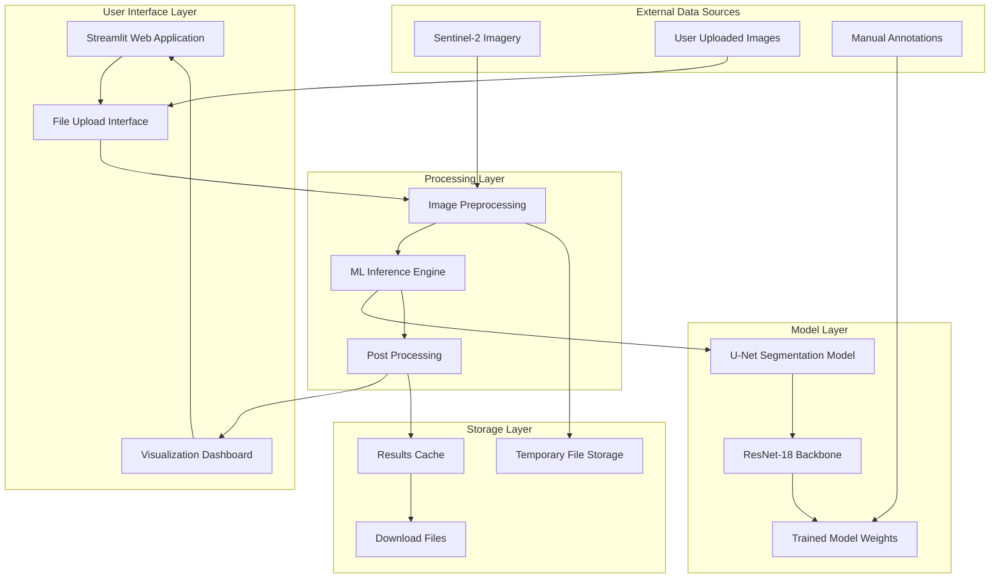

### Detailed Component Architecture

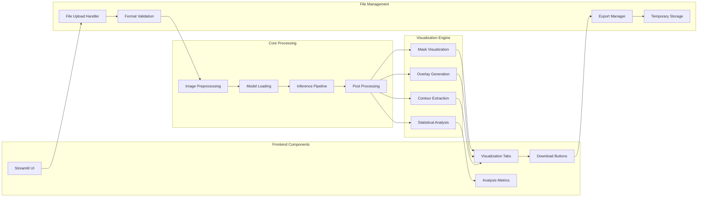

## 🔄 User Interaction Flow

### Complete User Journey

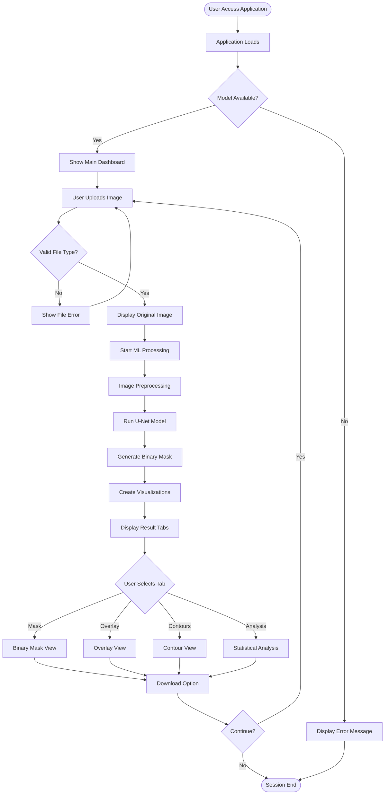

### Detailed Processing Pipeline

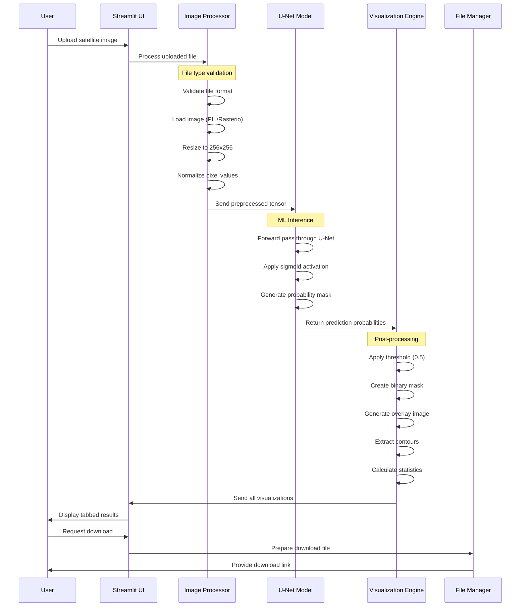

## 🧠 Model Architecture Flow

### U-Net Architecture Details

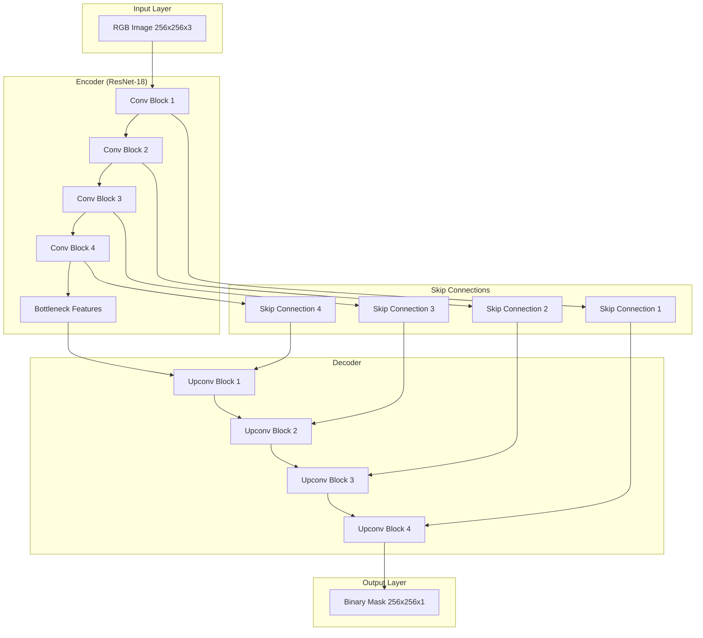

### Training and Inference Pipeline

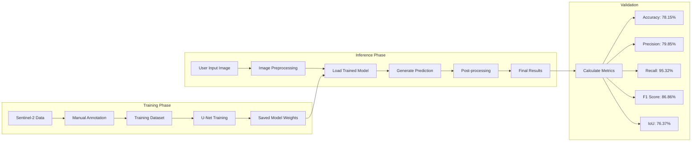

## 📊 Data Flow Architecture

### End-to-End Data Processing

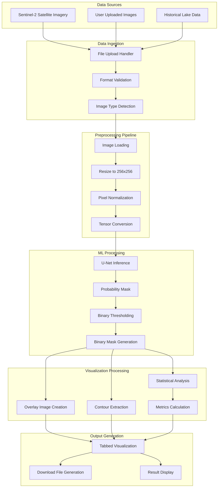

## 🔧 Technical Implementation Flow

### Application Startup and Model Loading

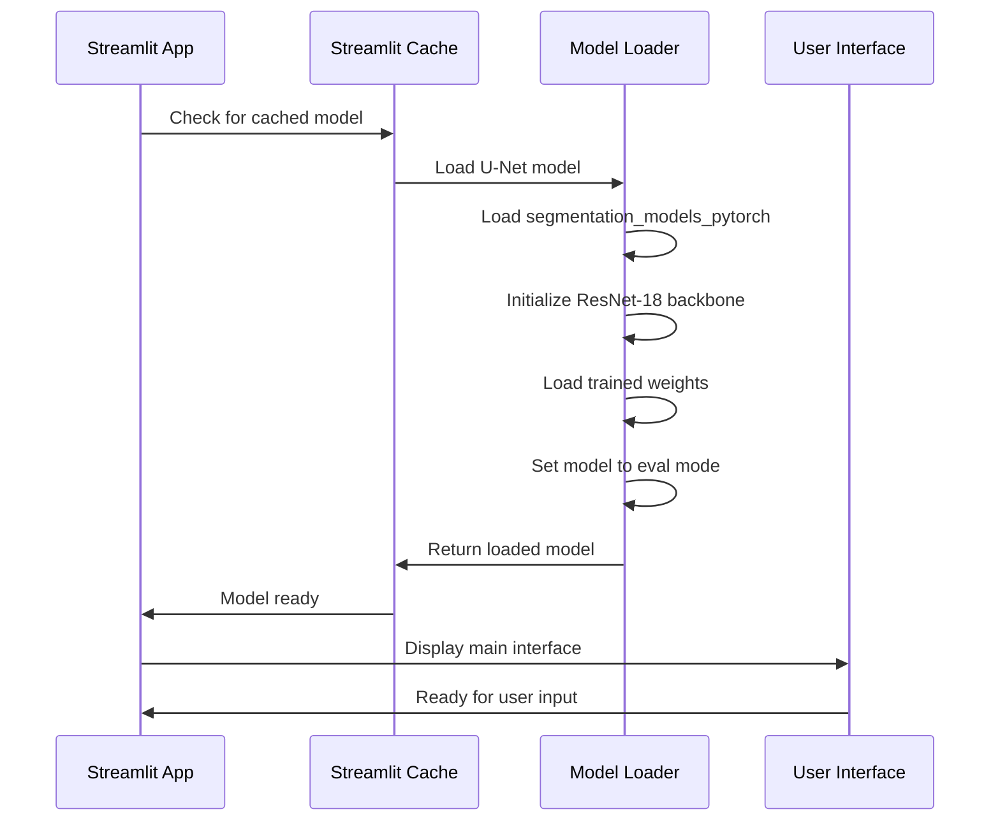

### Error Handling and Fallback Systems

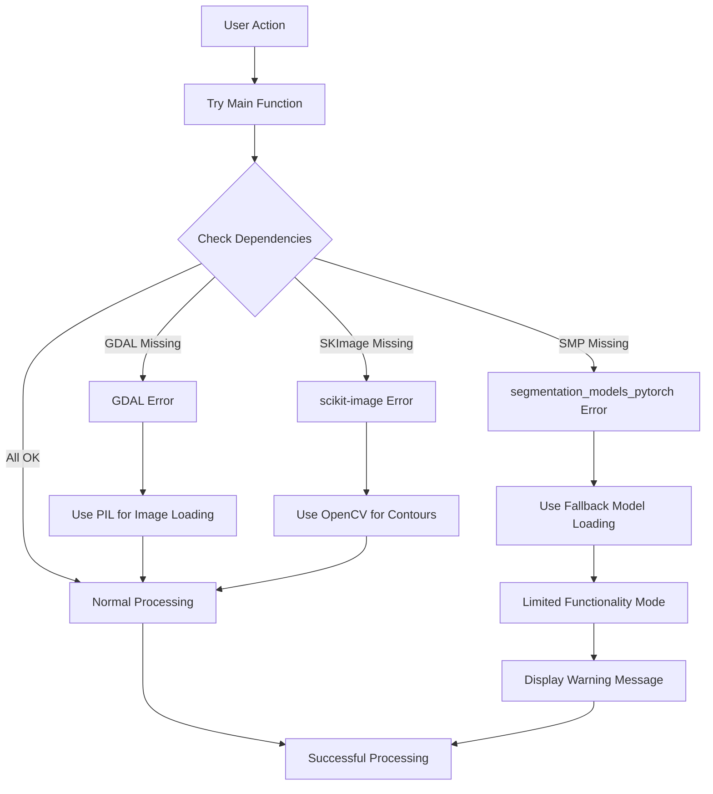

## 🎨 Sample Results

| Input Image | Binary Mask | Overlay Image |
|-------------|-------------|---------------|
|  |  |  |


## 📉 Confusion Matrix & Metrics

Based on our final training logs, here are the real evaluation metrics:

| Metric                  | Value  |
|-------------------------|--------|
| **Accuracy**            | 78.15% |
| **Precision**           | 79.85% |
| **Recall**              | 95.32% |
| **F1 Score**            | 86.86% |
| **IoU (Jaccard Index)** | 76.37% |

🧾 From final epoch's confusion matrix:

```
[[ 752  192]
 [  39  753]]
```

## ✨ Features

- **Multi-format Image Support**: Upload `.tif`, `.png`, `.jpg` satellite images
- **Detailed Visualization Options**:
  - Binary lake mask generation
  - Overlay visualization (original + prediction)
  - Contour extraction and display
  - Statistical analysis of lake coverage
- **Download Options**: Export masks, overlays and contour maps as PNG files
- **User-friendly Interface**: Intuitive Streamlit interface with tabbed visualization
- **Robust Processing**: Fallback mechanisms for handling different file types and missing dependencies

## 🚀 Installation & Run

1. **Clone the repository**:
   ```bash
   git clone https://github.com/yourusername/glacial-lake-detection.git
   cd glacial-lake-app
   ```

2. **Create a virtual environment (optional but recommended)**:
   ```bash
   python -m venv venv
   venv\Scripts\activate  # Windows
   source venv/bin/activate  # Linux/MacOS
   ```

3. **Install dependencies**:
   ```bash
   # Option 1: Using the provided script
   install_dependencies.bat
   
   # Option 2: Manual installation
   pip install -r requirements.txt
   ```

4. **Download the model**:
   Ensure `unet_model_augmented.pth` is placed in the root directory of the application.

5. **Run the application**:
   ```bash
   streamlit run app.py
   ```

## 💻 Usage

1. **Start the application**:
   ```
   streamlit run app.py
   ```

2. **Upload an image**:
   - Use the file uploader to select a `.tif`, `.png`, or `.jpg` file
   - For best results, use RGB satellite imagery

3. **View results**:
   - Navigate through the tabs to view different visualizations
   - Download any of the outputs using the provided buttons

4. **Interpret results**:
   - Blue regions in the mask represent detected glacial lakes
   - Contours show lake boundaries
   - The Analysis tab provides quantitative information about coverage

## 🧠 Model Details

- **Architecture**: U-Net with ResNet-18 encoder
- **Input Size**: 256×256 pixels (images are automatically resized)
- **Output**: Binary segmentation mask
- **Training Data**: Custom annotated dataset from Sentinel-2 imagery
- **Regions**: Primarily trained on imagery from Ladakh, Himachal Pradesh, and Nepal

## 📂 Project Structure

```
glacial-lake-detection/
│
├── app.py                   # Main Streamlit application
├── requirements.txt          # Python package dependencies
├── install_dependencies.bat  # Windows dependency installation script
├── assets/                   # Folder for demo images and assets
│   ├── demo.png              # Demo image showing results
│   ├── sample_input.png      # Sample input image
│   ├── sample_mask.png       # Sample binary mask
│   ├── sample_overlay.png    # Sample overlay image
│   └── confusion_matrix.png  # Confusion matrix image
├── models/                  # Folder for storing trained models
│   └── unet_model_augmented.pth  # Pre-trained U-Net model
├── utils.py                 # Utility functions for image processing and model inference
└── README.md                # Project documentation
```

## ⏭️ Future Work

- Integrate additional data sources (e.g., Landsat, MODIS) for broader coverage
- Implement change detection to monitor lake expansion/contraction over time
- Enhance model architecture for improved accuracy and generalization
- Develop a web-based GIS interface for interactive data exploration

## 🛠️ Troubleshooting

- **Issue**: Application crashes on startup
  - **Solution**: Ensure all dependencies are correctly installed. Check Python and package versions.
- **Issue**: Model fails to load
  - **Solution**: Verify `unet_model_augmented.pth` is in the correct directory. Re-download the model if necessary.
- **Issue**: Image upload not working
  - **Solution**: Check file format and size. Ensure the file is not corrupted.

## 📚 References & Resources

- [U-Net: Convolutional Networks for Biomedical Image Segmentation](https://arxiv.org/abs/1505.04597)
- [Segmentation Models PyTorch](https://github.com/qubvel/segmentation_models.pytorch)
- [Streamlit Documentation](https://docs.streamlit.io/library)
- [PyTorch Documentation](https://pytorch.org/docs/stable/index.html)

## 👤 Author

[Tejas Bhurbhure](https://github.com/tejuiceB)
