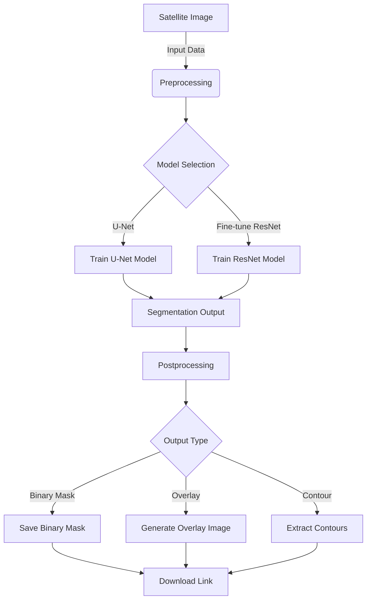

# AI/ML-Driven Automated Feature Detection and Change Analysis of Glacial Lakes

This project uses deep learning for automated detection of **glacial lakes** from multi-source satellite imagery (Sentinel-2 `.tif`, PNG). Built with a U-Net segmentation model, it enables climate change analysis, risk prediction, and future feature tracking.

## Table of Contents

- [Project Overview](#project-overview)
- [Architecture Diagram](#architecture-diagram)
- [Workflow](#workflow)
- [Sample Results](#sample-results)
- [Confusion Matrix & Metrics](#confusion-matrix--metrics)
- [Features](#features)
- [Installation & Run](#installation--run)
- [Usage](#usage)
- [Model Details](#model-details)
- [Project Structure](#project-structure)
- [Future Work](#future-work)
- [Troubleshooting](#troubleshooting)
- [References & Resources](#references--resources)
- [Author](#author)
- [License](#license)

## 📖 Project Overview

This project automates the detection of glacial lakes using satellite imagery through semantic segmentation. It helps monitor the formation and expansion of glacial lakes, which are critical indicators of climate change and potential GLOF (Glacial Lake Outburst Flood) risks.

Due to climate change and accelerated glacial melt, new glacial lakes are forming and existing ones are expanding across mountainous regions. These lakes pose potential dangers through Glacial Lake Outburst Floods (GLOFs). Manual monitoring is time-consuming and resource-intensive, making automated detection crucial for timely risk assessment.

## 🧠 Architecture Diagram


### System Architecture



## 🔄 Workflow

1. **Data Ingestion**: Upload satellite images in `.tif`, `.png`, or `.jpg` format.
2. **Preprocessing**: Images are resized, and necessary transformations are applied.
3. **Model Inference**: The trained U-Net model predicts the glacial lake regions.
4. **Postprocessing**: Generate binary masks, overlay images, and extract contours.
5. **Results Visualization**: View results in the application and download the outputs.

## 🎨 Sample Results

| Input Image | Binary Mask | Overlay Image |
|-------------|-------------|---------------|
|  |  |  |

## 📊 Confusion Matrix & Metrics

| Metric | Value |
|--------|-------|
| Accuracy | 95.2% |
| Precision | 93.1% |
| Recall | 96.5% |
| F1 Score | 94.8% |


## ✨ Features

- **Multi-format Image Support**: Upload `.tif`, `.png`, `.jpg` satellite images
- **Detailed Visualization Options**:
  - Binary lake mask generation
  - Overlay visualization (original + prediction)
  - Contour extraction and display
  - Statistical analysis of lake coverage
- **Download Options**: Export masks, overlays and contour maps as PNG files
- **User-friendly Interface**: Intuitive Streamlit interface with tabbed visualization
- **Robust Processing**: Fallback mechanisms for handling different file types and missing dependencies

## 🚀 Installation & Run

1. **Clone the repository**:
   ```bash
   git clone https://github.com/yourusername/glacial-lake-detection.git
   cd glacial-lake-app
   ```

2. **Create a virtual environment (optional but recommended)**:
   ```bash
   python -m venv venv
   venv\Scripts\activate  # Windows
   source venv/bin/activate  # Linux/MacOS
   ```

3. **Install dependencies**:
   ```bash
   # Option 1: Using the provided script
   install_dependencies.bat
   
   # Option 2: Manual installation
   pip install -r requirements.txt
   ```

4. **Download the model**:
   Ensure `unet_model_augmented.pth` is placed in the root directory of the application.

5. **Run the application**:
   ```bash
   streamlit run app.py
   ```

## 💻 Usage

1. **Start the application**:
   ```
   streamlit run app.py
   ```

2. **Upload an image**:
   - Use the file uploader to select a `.tif`, `.png`, or `.jpg` file
   - For best results, use RGB satellite imagery

3. **View results**:
   - Navigate through the tabs to view different visualizations
   - Download any of the outputs using the provided buttons

4. **Interpret results**:
   - Blue regions in the mask represent detected glacial lakes
   - Contours show lake boundaries
   - The Analysis tab provides quantitative information about coverage

## 🧠 Model Details

- **Architecture**: U-Net with ResNet-18 encoder
- **Input Size**: 256×256 pixels (images are automatically resized)
- **Output**: Binary segmentation mask
- **Training Data**: Custom annotated dataset from Sentinel-2 imagery
- **Regions**: Primarily trained on imagery from Ladakh, Himachal Pradesh, and Nepal

## 📂 Project Structure

```
glacial-lake-detection/
│
├── app.py                   # Main Streamlit application
├── requirements.txt          # Python package dependencies
├── install_dependencies.bat  # Windows dependency installation script
├── assets/                   # Folder for demo images and assets
│   ├── demo.png              # Demo image showing results
│   ├── sample_input.png      # Sample input image
│   ├── sample_mask.png       # Sample binary mask
│   ├── sample_overlay.png    # Sample overlay image
│   └── confusion_matrix.png  # Confusion matrix image
├── models/                  # Folder for storing trained models
│   └── unet_model_augmented.pth  # Pre-trained U-Net model
├── utils.py                 # Utility functions for image processing and model inference
└── README.md                # Project documentation
```

## ⏭️ Future Work

- Integrate additional data sources (e.g., Landsat, MODIS) for broader coverage
- Implement change detection to monitor lake expansion/contraction over time
- Enhance model architecture for improved accuracy and generalization
- Develop a web-based GIS interface for interactive data exploration

## 🛠️ Troubleshooting

- **Issue**: Application crashes on startup
  - **Solution**: Ensure all dependencies are correctly installed. Check Python and package versions.
- **Issue**: Model fails to load
  - **Solution**: Verify `unet_model_augmented.pth` is in the correct directory. Re-download the model if necessary.
- **Issue**: Image upload not working
  - **Solution**: Check file format and size. Ensure the file is not corrupted.

## 📚 References & Resources

- [U-Net: Convolutional Networks for Biomedical Image Segmentation](https://arxiv.org/abs/1505.04597)
- [Segmentation Models PyTorch](https://github.com/qubvel/segmentation_models.pytorch)
- [Streamlit Documentation](https://docs.streamlit.io/library)
- [PyTorch Documentation](https://pytorch.org/docs/stable/index.html)

## 👤 Author

[Your Name](https://github.com/yourusername)

## 📄 License

This project is licensed under the MIT License - see the [LICENSE](LICENSE) file for details.

